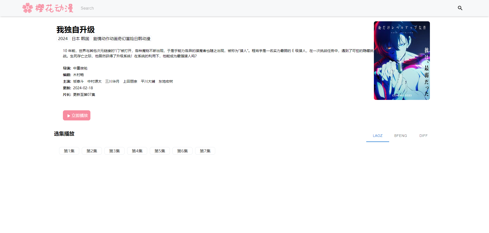
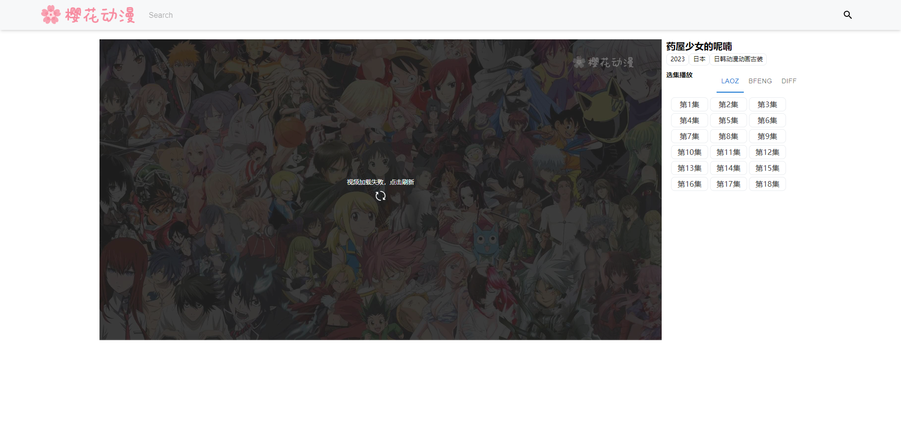

# 樱花动漫

## 技术栈

<h3>react18+redux+tailwindcss</h3>
1. [x] react18
2. [x] redux
3. [x] react-router-dom
4. [x] axios+swr
5. [x] react-infinite-scroller
6. [x] tailwindcss + mui
7. [x] swiper
8. [x] sass

## 特点

1. [x] 响应式pc和mobile
2. [x] 支持分词搜索
3. [x] 支持(pc)分页和(mobile)无限加载

## 测试地址
[樱花动漫](http://185.242.234.97:10002/)

## 测试图片

  

  

  

  

  

  

  

